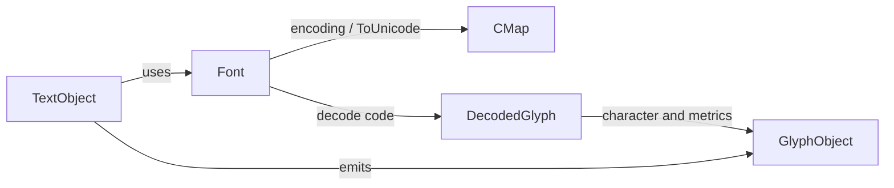
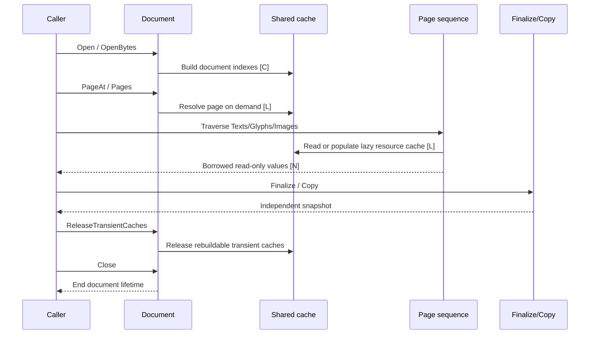

# Core Domain Model

English | [简体中文](core-domain-model.zh-CN.md)

go-playa is organized around a PDF document, then a page, and finally the
objects interpreted from page content. Fonts, images, navigation, forms, and
tagged-PDF structure connect to that page and document graph. Public packages
are the consumer boundary; `document` is the public owner of document-wide
parsing, lifecycle, and shared coordination. The `document` package implements
the public engine directly, using `parser` and the owning domain packages.

## Relationship Overview

```mermaid
flowchart TB
    subgraph Public[Public domain packages]
        DocumentEngine[document package: public engine]
        Document[document.Document]
        Page[page.Page]
        Content[content.ContentObject]
        Operations[content.ContentOp]
        Text[content.TextObject]
        Glyph[content.GlyphObject]
        Path[content.PathObject]
        Image[content.ImageObject]
        Tag[content.TagObject]
        XObject[content.XObjectObject]
        FontResource[page.FontResource]
        Font[font.Font]
        CMap[font.CMap]
        DecodedGlyph[font.DecodedGlyph]
        Annotation[page.Annotation]
        Form[page.FormField]
        Outline[outline.Node]
        Destination[outline.Destination]
        Action[outline.Action]
        RawDestinations["map[string]pdftypes.Object"]
        DestinationEntry[document.DestinationEntry]
        PageStructure[page.PageStructure]
        MarkedContent[content.MarkedContent]
        Structure[structure.Element]
        PDFTypes[pdftypes.Object / Dict / Stream / Ref]
        DocumentData[documentdata.Metadata]
        IndirectObject[documentdata.IndirectObject]
        ImageData[imagedata.ColorSpace]
        ContentData[contentdata.PropertiesObject / MarkedContentContext / ContentOp / MarkedContent / GraphicsState]
    end

    subgraph Input[Input layer]
        Parser[parser.Lexer / ObjectParser]
    end

    Document -->|Pages / PageAt| Page
    Document -->|Info / Catalog| PDFTypes
    Document -->|Objects| IndirectObject
    IndirectObject -->|ValueCopy| PDFTypes
    Document -->|Metadata| DocumentData
    Document -->|Outline| Outline
    Outline -->|TargetCopyWithError| Destination
    Outline -->|ActionValueCopyWithError| Action
    Document -->|Destinations| RawDestinations
    RawDestinations -->|Document.ResolveDestinationWithError on a value| Destination
    Document -->|DestinationsSeq| DestinationEntry
    DestinationEntry -->|DestinationWithError| Destination
    Document -->|OpenAction| Action
    Document -->|StructureTreeSeq| Structure
    Document -->|FormFields| Form
    Page -->|Interp / Flatten| Content
    Page -->|Contents| Operations
    Page -->|Annotations| Annotation
    Page -->|FontsSeq| FontResource
    FontResource -->|FontCopyWithError| Font
    Page -->|XObjects| XObject
    Page -->|Images| Image
    Page -->|Structure| PageStructure
    PageStructure -->|ElementsCopyWithError| Structure
    Page -->|MarkedContent| MarkedContent
    MarkedContent -->|ParentWithError| Structure
    Content --> Text
    Content --> Path
    Content --> Image
    Image -->|scalar color-space value| ImageData
    Content -->|named resource selections| ContentData
    Content --> Tag
    Content --> XObject
    Text -->|resolved font| Font
    Text -->|characters| Glyph
    Glyph -->|font metrics and mapping| Font
    Font -->|encoding / mapping| CMap
    Font -->|decoded code points| DecodedGlyph
    Image -->|stream and color space| PDFTypes
    Annotation -->|DestinationWithError| Destination
    Annotation -->|ActionValueCopyWithError| Action
    Tag -->|ParentWithError| Structure
    Parser -->|lex and parse| DocumentEngine
    DocumentEngine -->|implements| Document
    DocumentEngine --> PDFTypes
```



## Cache Legend

The diagrams use these markers to describe implementation behavior:

- `[C]`: a successful result is cached and reusable during the immutable
  document lifetime.
- `[L]`: resolution or decoding is lazy; the result is created on demand and
  is usually reusable after successful consumption.
- `[N]`: the sequence is repeatable, but one traversal does not publish a
  shared materialized slice.

These markers do not change ownership rules. Borrowed values remain read-only
regardless of whether the underlying result is cached.

## Document-Level Model

`Document` opens the PDF, maintains document-level indexes, and exposes
cross-page semantics:

- Page access: `Pages`, `PageAt`, `PageByRef`, page counts, and page labels.
- Document semantics: catalog, metadata, name trees, destinations, actions,
  outlines, forms, and tagged-PDF structure.
- Raw objects: `Objects`, `Object`, `Trailer`, and `Buffer`.
- Dependency-free values: `documentdata` owns `PageLabelSpec`, `XRefEntry`,
  `IndirectObject`, `NameTreeEntry`, `DestinationEntry`, `Destination`, and
  the pure value portion of `Action`; `document` retains tree traversal,
  object lookup, ordering, cache coordination, page/coordinate-space
  resolution, and lazy Action `/Next` traversal. Destination parameters and
  action raw dictionaries are exposed only through read-only copies and
  `Finalize`, so document cache state cannot be mutated by callers.
- Lifecycle: `Close` and `ReleaseTransientCaches`. These operations are
  exclusive with page callbacks and page-level parallel work.

Typical cache boundaries are:

| Model or resource | Marker | Behavior |
| --- | --- | --- |
| Page count, page tree, and page objects | `[C]` | Successful page-tree results are reused; damaged trees use controlled fallback scanning. |
| Fonts, page font resources, and image resources | `[L]` / `[C]` | Resources are resolved on first access and successful results can be reused. |
| Content streams, Form XObjects, and filtered bytes | `[L]` / `[C]` | Filtering and interpretation happen on demand; parser state is not shared between traversals. |
| Metadata, name trees, destinations, and actions | `[L]` / `[C]` | The first request establishes the document-level result, including error propagation. |
| Object-stream expansion and xref indexes | `[L]` / `[C]` | Expanded only when an indirect object is needed; failed object streams are not marked successful. |

## Page-Level Model

`Page` is the main unit for concurrency and content extraction. A page can
inherit fonts, color spaces, XObjects, and properties from document resources,
then expose the interpreted content through repeatable sequences:

`Page.Number` retains the existing Go-side one-based display number, while
`Page.Index` maps to Playa's zero-based `page_idx`. Both values remain aligned
through normal page-tree traversal and damaged-document fallback scanning.
`Page.Space` retains the document's open-time device-space selection. Geometry
uses the owning document's current option for attached pages, and the page's
own `Space` for manually constructed pages without a document configuration.

```mermaid
flowchart LR
    P[Page]
    Streams[Streams<br/>[L]]
    Ops[Contents: ContentOp sequence<br/>[N]]
    Texts[Texts<br/>[N]]
    Glyphs[Glyphs<br/>[N]]
    Paths[Paths<br/>[N]]
    Images[Images<br/>[L]]
    XObjects[XObjects / Form content<br/>[L]]
    Tags[Tags / MarkedContent<br/>[N]]
    P --> Streams --> Ops
    Ops --> Texts --> Glyphs
    Ops --> Paths
    Ops --> Images
    Ops --> XObjects
    Ops --> Tags
```

Page content sequences support repeatable traversal and early termination.
`Collect...` and `Finalize` methods are explicit materialization or snapshot
boundaries and should not be the default extraction path.

The page-level concurrency guarantee is that multiple goroutines may read
different `Page` values from one open document. Internal locks protect shared
document indexes and resource caches, while interpreter state remains local to
each traversal. Do not call `Close` or `ReleaseTransientCaches` until all
callbacks have completed.

## Content, Fonts, and Images

The content interpreter maps PDF operations to stable domain objects:

- `TextObject` stores text, matrices, font, rendering state, and displacement.
- `GlyphObject` stores character mapping, position, bounds, and font metadata.
- `PathObject` stores path segments and graphics state.
- `ImageObject` retains image streams, dictionaries, color spaces, and lazy
  sample decoding results.
- `TagObject`, `MarkedContent`, and `XObjectObject` retain links to structure
  trees and Form XObject content.
- `FontMetadata` provides a scalar font-descriptor snapshot, including
  `Leading`, `CapHeight`, `StemV`, `FontMatrix`, and presence flags, without
  materializing lazy CMaps or embedded font programs.

The font relationship can be summarized as:



Fonts and images are generally lazy resources. Obtaining a `Font` or an
`ImageObject` does not mean that all embedded data has already been decoded;
samples, palettes, CMaps, ToUnicode data, and glyph paths continue parsing
when consumed.

## Navigation, Forms, and Tagged PDF

- `outline.Node` represents an outline tree node and may reference a
  `Destination` or `Action`.
- `page.Annotation` represents a page annotation with geometry, appearance,
  destinations, actions, and structure-parent keys.
- `page.FormField` represents the AcroForm field tree; fields and widgets link
  their parent/child relationships to pages.
- `structure.Element` represents a tagged-PDF structure node, while
  `structure.Content` maps content back to page content, MCIDs, or indirect
  objects.
- `ParentTree` maps page or structure-parent keys back to tagged content and
  bridges page queries with the structure tree.

All of these trees expose lazy sequences and explicit materialization paths.
If a later node is malformed, materialization reports the error instead of
publishing an incomplete successful result.

## Borrowing, Snapshots, and Release



Borrowed values are suitable for immediate reads within the current traversal
or callback. To retain a value across goroutines, traversals, or cache-release
boundaries, call the relevant `Finalize`, `Copy`, or `...Copy` method. A
snapshot pays the copy cost explicitly; this is the trade-off between stable
ownership and the low-memory borrowed path.

## Package and Implementation Boundaries

| Layer | Packages | Responsibility |
| --- | --- | --- |
| Entry points | root package, `document` | Open documents and access document-level models. |
| Pages | `page` | Pages, resources, annotations, forms, and page sequences. |
| Content | `content` | Content operations, text, glyphs, paths, images, marks, and layout. |
| Resources | `font`, `fontdata`, `image` | Fonts/CMaps/glyphs and images/color spaces/filter decoding. |
| Document values | `documentdata` | Dependency-free document metadata, page-label values, xref entries, indirect objects, named-destination entries, normalized destinations, and action value data. |
| Image values | `imagedata` | Dependency-free packed image sample expansion and color-space scalar values; document-owned lookup bytes, filter parameters, and lazy decode caches remain in `document`. |
| Content values | `contentdata` | Dependency-free BDC/DP Properties selection values, marked-content contexts, ContentOp, MarkedContent values, and GraphicsState snapshots; resource lookup, mutable interpreter state, lazy child nodes, source-order traversal, interpreter identity, Form boundaries, and errors remain in `document`. |
| Semantics | `outline`, `structure` | Navigation trees, actions, destinations, and tagged-PDF structure. |
| Geometry | `geometry`, `coordinates` | Matrices, path segments, colors, and coordinate-space values. |
| Primitives | `pdftypes`, `parser` | PDF values, lexical analysis, and object parsing. |
| Configuration | `cacheconfig`, `contentconfig`, `documentconfig`, `parserconfig`, `structureconfig`, `textconfig` | Dependency-free cache, content, open, lexical, and structure configuration values. |
| Implementation | `document` | Lazy parsing, caching, locks, interpreters, document-aware page scheduling options, and cross-domain coordination. |

The tracked migration scope is complete; the compatibility manifest and the
checked-in and pinned public PDF corpora define its acceptance boundary. This
document describes the model and lifecycle contract that remains in force for maintenance.
