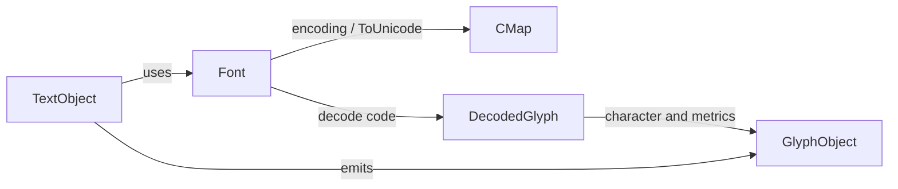
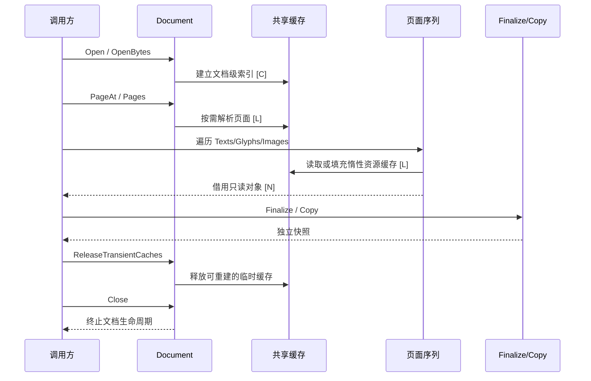

# 核心领域模型

[English](core-domain-model.md) | 简体中文

go-playa 的模型以 PDF 文档为根，沿着“文档 -> 页面 -> 内容对象”展开；字体、图像、导航和 tagged PDF 结构通过页面或文档级关系连接起来。公开包是使用边界，`document` 是文档级实现和生命周期的公开归属。`document` 包直接实现公开引擎，并使用 `parser` 和相应领域包。

## 关系总览

```mermaid
flowchart TB
    subgraph Public[公开领域包]
        DocumentEngine[document 包：公开引擎]
        Document[document.Document]
        Page[page.Page]
        Content[content.ContentObject]
        Operations[content.ContentOp]
        Text[content.TextObject]
        Glyph[content.GlyphObject]
        Path[content.PathObject]
        Image[content.ImageObject]
        Tag[content.TagObject]
        XObject[content.XObjectObject]
        FontResource[page.FontResource]
        Font[font.Font]
        CMap[font.CMap]
        DecodedGlyph[font.DecodedGlyph]
        Annotation[page.Annotation]
        Form[page.FormField]
        Outline[outline.Node]
        Destination[outline.Destination]
        Action[outline.Action]
        RawDestinations["map[string]pdftypes.Object"]
        DestinationEntry[document.DestinationEntry]
        PageStructure[page.PageStructure]
        MarkedContent[content.MarkedContent]
        Structure[structure.Element]
        PDFTypes[pdftypes.Object / Dict / Stream / Ref]
        DocumentData[documentdata.Metadata]
        IndirectObject[documentdata.IndirectObject]
        ImageData[imagedata.ColorSpace]
        ContentData[contentdata.PropertiesObject / MarkedContentContext / ContentOp / MarkedContent / GraphicsState]
    end

    subgraph Input[输入层]
        Parser[parser.Lexer / ObjectParser]
    end

    Document -->|Pages / PageAt| Page
    Document -->|Info / Catalog| PDFTypes
    Document -->|Objects| IndirectObject
    IndirectObject -->|ValueCopy| PDFTypes
    Document -->|Metadata| DocumentData
    Document -->|Outline| Outline
    Outline -->|TargetCopyWithError| Destination
    Outline -->|ActionValueCopyWithError| Action
    Document -->|Destinations| RawDestinations
    RawDestinations -->|Document.ResolveDestinationWithError on a value| Destination
    Document -->|DestinationsSeq| DestinationEntry
    DestinationEntry -->|DestinationWithError| Destination
    Document -->|OpenAction| Action
    Document -->|StructureTreeSeq| Structure
    Document -->|FormFields| Form
    Page -->|Interp / Flatten| Content
    Page -->|Contents| Operations
    Page -->|Annotations| Annotation
    Page -->|FontsSeq| FontResource
    FontResource -->|FontCopyWithError| Font
    Page -->|XObjects| XObject
    Page -->|Images| Image
    Page -->|Structure| PageStructure
    PageStructure -->|ElementsCopyWithError| Structure
    Page -->|MarkedContent| MarkedContent
    MarkedContent -->|ParentWithError| Structure
    Content --> Text
    Content --> Path
    Content --> Image
    Image -->|scalar color-space value| ImageData
    Content -->|named resource selections| ContentData
    Content --> Tag
    Content --> XObject
    Text -->|resolved font| Font
    Text -->|characters| Glyph
    Glyph -->|font metrics and mapping| Font
    Font -->|encoding / mapping| CMap
    Font -->|decoded code points| DecodedGlyph
    Image -->|stream and color space| PDFTypes
    Annotation -->|DestinationWithError| Destination
    Annotation -->|ActionValueCopyWithError| Action
    Tag -->|ParentWithError| Structure
    Parser -->|lex and parse| DocumentEngine
    DocumentEngine -->|implements| Document
    DocumentEngine --> PDFTypes
```



## 图中缓存标记

关系图和生命周期图使用以下标记描述实现行为：

- `[C]`：成功结果会被缓存，可在同一不可变文档生命周期内复用。
- `[L]`：按需解析或解码，首次消费时才建立结果；成功结果通常可复用。
- `[N]`：序列本身可重复遍历，但不会因为一次遍历就发布共享的完整切片。

缓存标记不改变所有权规则：借用对象仍然只读，不能通过公开字段或返回的切片修改文档内部状态。

## 文档级模型

`Document` 负责打开 PDF、维护文档级索引，并提供页面和跨页面语义：

- 页面访问：`Pages`、`PageAt`、`PageByRef`、页数和页标签。
- 文档语义：目录、元数据、NameTree、目的地、动作、大纲、表单和 tagged PDF 结构。
- 原始对象：`Objects`、`Object`、`Trailer` 和 `Buffer`。
- 依赖无关值：`documentdata` 承载 `PageLabelSpec`、`XRefEntry`、`IndirectObject`、
  `NameTreeEntry`、`DestinationEntry`、`Destination` 和 `Action` 的纯值部分；
  `document` 保留树遍历、对象查找、排序、缓存协调、页面/坐标空间解析及
  Action 的惰性 `/Next` 链。目的地参数和动作原始字典通过只读副本与
  `Finalize` 暴露，不能修改文档内部缓存。
- 生命周期：`Close` 和 `ReleaseTransientCaches`；这些操作与页面回调及页面级并发互斥。

典型缓存边界如下：

| 模型/资源 | 标记 | 说明 |
| --- | --- | --- |
| 页面计数、页面树和页面对象 | `[C]` | 页面树成功解析后复用；损坏树使用受控的 fallback 扫描。 |
| 字体、页面字体资源、图像资源 | `[L]` / `[C]` | 首次访问时解析资源；成功结果可供后续页面或重复访问复用。 |
| 内容流、Form XObject、过滤后字节 | `[L]` / `[C]` | 过滤和解析按需发生；解析器状态不会在遍历之间共享。 |
| 元数据、NameTree、目的地、动作 | `[L]` / `[C]` | 首次请求建立文档级结果，并保留失败状态或错误传播语义。 |
| 对象流展开和 xref 索引 | `[L]` / `[C]` | 只在间接对象被需要时展开；失败对象流不会标记为成功展开。 |

## 页面级模型

`Page` 是并发和内容提取的主要工作单元。一个页面可以从文档资源继承字体、颜色空间、XObject 和属性，并把内容流解释为可重复的序列：

`Page.Number` 保留 Go 侧已有的 1-based 展示编号；`Page.Index` 对应 Playa
的 0-based `page_idx`，在正常页面树和损坏文档的 fallback 扫描中保持一致。
`Page.Space` 保存打开文档时选定的设备空间；页面挂在文档上时，几何变换
以文档当前选项为准，脱离文档的手工页面则使用自身的 `Space`。

```mermaid
flowchart LR
    P[Page]
    Streams[Streams<br/>[L]]
    Ops[Contents: ContentOp sequence<br/>[N]]
    Texts[Texts<br/>[N]]
    Glyphs[Glyphs<br/>[N]]
    Paths[Paths<br/>[N]]
    Images[Images<br/>[L]]
    XObjects[XObjects / Form content<br/>[L]]
    Tags[Tags / MarkedContent<br/>[N]]
    P --> Streams --> Ops
    Ops --> Texts --> Glyphs
    Ops --> Paths
    Ops --> Images
    Ops --> XObjects
    Ops --> Tags
```

页面内容序列支持重复遍历和提前终止。`Collect...` 或 `Finalize` 类方法是明确的物化/快照边界，不应作为默认提取路径使用。

页面级并发保证是：多个 goroutine 可以在同一个已打开文档上读取不同 `Page`；文档共享索引和资源缓存由内部锁保护，页面解释器状态保持在各自遍历中。所有回调完成前，不应调用 `Close` 或 `ReleaseTransientCaches`。

## 内容、字体和图像

内容解释器把 PDF 操作映射为稳定的领域对象：

- `TextObject` 保存文本、矩阵、字体、渲染状态和位移信息。
- `GlyphObject` 保存单个字符的映射、位置、边界和字体元数据。
- `PathObject` 保存路径段和图形状态。
- `ImageObject` 保留图像流、字典、颜色空间和延迟样本解码结果。
- `TagObject`、`MarkedContent` 和 `XObjectObject` 保留内容与结构树、Form XObject 的关联。
- `FontMetadata` 提供字体描述符的标量快照（包括 `Leading`、`CapHeight`、`StemV`、
  `FontMatrix` 及存在性标志），不会因此物化惰性 CMap 或嵌入字体程序。

字体关系可以简化为：



字体和图像通常是惰性资源。获取 `Font` 或 `ImageObject` 不等于已经解码全部嵌入数据；样本、调色板、CMap、ToUnicode 和字形路径在实际消费时才会继续解析。

## 导航、表单和 tagged PDF

- `outline.Node` 表示大纲树节点，并可关联 `Destination` 或 `Action`。
- `page.Annotation` 表示页面注释，可携带矩形、外观、目的地、动作和结构父键。
- `page.FormField` 表示 AcroForm 字段树；字段和 Widget 通过父子关系连接到页面。
- `structure.Element` 表示 tagged PDF 结构树节点，`structure.Content` 把结构内容映射回页面内容、MCID 或间接对象。
- `ParentTree` 把页面或结构父键映射回 tagged 内容，是页面结构查询的桥梁。

这些树都提供惰性序列和显式物化路径。物化遇到后续节点错误时，应返回错误而不是发布不完整的成功结果。

## 借用、快照和释放



借用对象适合在当前遍历或回调中立即读取。需要跨 goroutine、跨遍历或跨缓存释放边界保存时，应调用对象提供的 `Finalize`、`Copy` 或 `...Copy` 方法。快照会承担复制成本；这是稳定性和低内存借用路径之间的显式取舍。

## 包和实现边界

| 层 | 包 | 责任 |
| --- | --- | --- |
| 入口 | 根包、`document` | 打开文档并访问文档级模型。 |
| 页面 | `page` | 页面、资源、注释、表单和页面序列。 |
| 内容 | `content` | 内容操作、文本、字形、路径、图像、标记和布局。 |
| 资源 | `font`、`fontdata`、`image` | 字体/CMap/字形以及图像/颜色空间/过滤解码。 |
| 文档值 | `documentdata` | 文档级元数据、页码标签、xref 条目、间接对象、命名目的地条目、规范化目的地和动作纯值等无解析依赖的值模型。 |
| 图像值 | `imagedata` | 无解析依赖的打包图像样本展开和颜色空间标量描述；文档级 lookup 字节、过滤参数及惰性解码缓存仍由 `document` 持有。 |
| 内容值 | `contentdata` | 无解析依赖的 BDC/DP Properties 选择值、marked-content 上下文、ContentOp、MarkedContent 和 GraphicsState 快照；资源查找、可变解释器状态、lazy 子节点、源顺序遍历、解释器 identity、Form 边界和错误仍由 `document` 持有。 |
| 语义 | `outline`、`structure` | 导航树、动作、目的地和 tagged PDF 结构。 |
| 几何 | `geometry`、`coordinates` | 矩阵、路径段、颜色值和坐标空间值。 |
| 原语 | `pdftypes`、`parser` | PDF 值、词法分析和对象解析。 |
| 配置 | `cacheconfig`、`contentconfig`、`documentconfig`、`parserconfig`、`structureconfig`、`textconfig` | 无解析依赖的缓存、内容、打开、词法和结构配置值。 |
| 实现 | `document` | 惰性解析、缓存、锁、解释器、依赖文档的页面调度选项和跨领域协调。 |

当前迁移范围已经完成；验收边界由兼容清单、检入的生成 PDF 和清单固定的公开 PDF corpus 定义。本文描述持续适用于后续维护的模型与生命周期契约。
